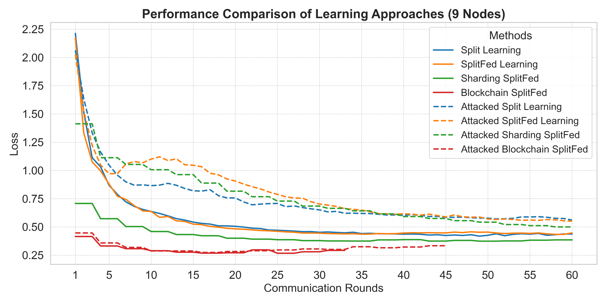
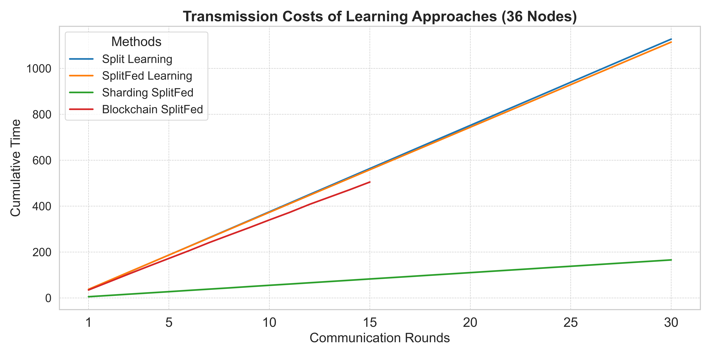

# Plotting

This branch contains the code for plotting the results of Split Learning (SL), SplitFed Learning (SFL), Sharded SplitFed Learning (SSFL), and Blockchain-based SplitFed Learning (BSFL). The data for these results is gathered from other branches of this repository, which are responsible for executing the respective experiments.

To regenerate the results, simply run the following command:
```
python3 plot.py
```
This will regenrate the results in the `figures` folder.

# Results
Through extensive evaluations of all Split Learning variations, we demonstrate that SSFL and BSFL outperform previous approaches across multiple categories, including security, scalability, and performance.

 

## Performance
We assess the performance of all the mentioned approaches by running each framework under different settings and conditions. SSFL and BSFL consistently outperform SL and SFL in terms of validation loss, as shown in the figures above.


## Security
We evaluate the security of each framework by performing data-poisoning attacks with various proportions. As evidenced by the figures above, BSFL demonstrates resilience against these threats, with its loss remaining consistent in both normal and attacked scenarios. This is not the case for other approaches, as they lack mechanisms to prevent such attacks on the collaborative learning framework.

## Scalability
Our results show significant improvements in terms of latency and scalability. These results are derived from experiments that measured the latency of each approach and compared them. The following figure illustrates this observation:



For further analysis of our results, please refer to our paper.


